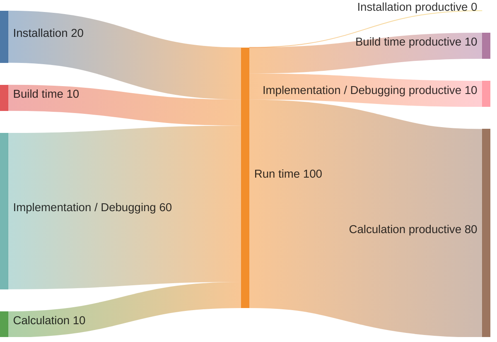
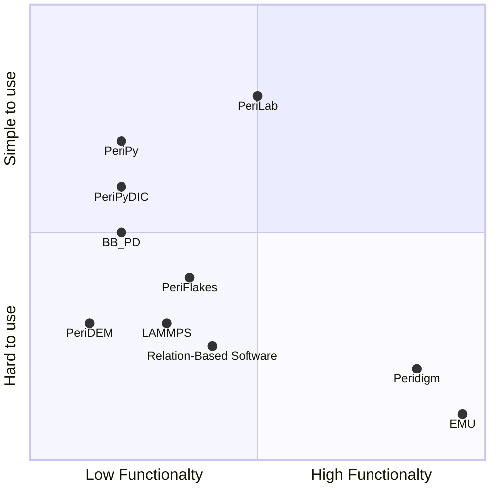

# PeriLab

- [Theory Manual](theory.md)

Welcome to the PeriLab documentation!

This resource aims to teach you everything you need to know to get up and
running with tabular data manipulation using the PeriLab.jl package.
 
## What is PeriLab.jl?

PeriLab.jl provides a Peridynamics [BobaruF2016](@cite) simulation core.

Its design and functionality are similar to those of Peridigm  [LittlewoodDJ2023](@cite) and several extenions [WillbergC2019](@cite), [WillbergC2023](@cite), [HesseJA2023](@cite).

## PeriLab.jl and the Peridynamics Ecosystem
Mesh-free particle-based methods are mostly used for the numerical approximation of peridynamics equations. [WillbergC2024](@cite) provides an overview of current Peridynamics software developments. In addition to this, many local research groups are also developing their software. Most of the listed tools are problem-specific or developed by a single person. The most sophisticated software tools are EMU and Peridigm. EMU is not open source, but researchers can request the code. However, due to the code developments at the Sandia National labs and the rules of development, the code is officially not usable because the rules violate the "Treaty on the Non-Proliferation of Nuclear Weapons".

Peridigm is an open-source tool that can be used for large-scale problems. It includes multiple material laws, simple damage models. Peridigm is usable under a BSD license. Currently, there is some irregular development ongoing. It provides multiple ways of model input and provides Paraview readable output. The whole code allows the analysis of large-scale problems. A lot of research has been performed utilizing the software.



One challenge, however, remains. How can Peridynamics be widely adopted? Classical continuum mechanics is extensively utilized in the engineering field through the finite element method. There is a multitude of commercial and non-commercial software tools available for this purpose. In the case of Peridynamics, this is not the case. Peridigm as the most advanced one provides an open-source code with many functionalities. However, the implementation effort is substantial, and the installation process is difficult and time-consuming.
To implement the simplest material law you have to edit at least five files. If you add new files and folders in the project you have to deal with cmake scripts and all challenges related to it.

Moreover, the program is only partially maintained. This results in valuable research findings being underutilized, and Peridynamics, as a result, finds limited application outside of specific niche problems. There is a significant need for software that combines functionality, easy installation, and seamless integration. 




## Questions?

If there is something you expect PeriLab to be capable of, but
cannot figure out how to do, please reach out with questions in Domains/Data on
[Discourse](https://github.com/PeriHub/PeriLab.jl/discussions).

Please report bugs by
[opening an issue](https://github.com/PeriHub/PeriLab.jl/issues/new/choose).

You can follow the **source** links throughout the documentation to jump right
to the source files on GitHub to make pull requests for improving the
documentation and function capabilities.

Please review [PeriLab contributing
guidelines](https://github.com/PeriHub/PeriLab.jl/blob/main/CONTRIBUTING.md)
before submitting your first PR!

Information on specific versions can be found on the [Release
page](https://github.com/PeriHub/PeriLab.jl/blob/main/CHANGELOG.md).

## Package Manual

```@contents
Pages = ["man/basics.md",
         "man/getting_started.md"]
Depth = 2
```

## API

Only exported (i.e. available for use without `PeriLab.` qualifier after
loading the PeriLab.jl package with `using PeriLab`) types and functions
are considered a part of the public API of the PeriLab.jl package. In general
all such objects are documented in this manual (in case some documentation is
missing please kindly report an issue
[here](https://github.com/PeriHub/PeriLab.jl/-/issues/new)).