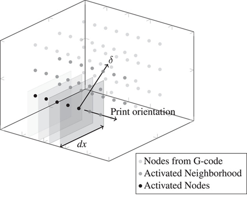

## Seminar 8: Additive manufacturing

$\underline{\omega}\langle\boldsymbol{\xi}\rangle \in \mathcal{H}_{\textbf{x}} =    \left\{\begin{array}{l}
0 \qquad\text{for }t<t_{activate}\\
1  \qquad\text{for }t \geq t_{activate}\\
\end{array}\right.$



figure (taken from [WillbergC2024b](@cite)).


```yaml
    Additive Models:
      Test:
        Additive Model: "Simple"
        Print Temperature: 100
```

[Additve Result](https://www.youtube.com/watch?v=E7--T9ONOhQ)

$$\boldsymbol{\varepsilon}=\boldsymbol{\varepsilon}_{mechanical} + \boldsymbol{\varepsilon}_{thermal}.$$
$$\boldsymbol{\varepsilon}_{thermal} =- \boldsymbol{\alpha}\tau$$
$$\boldsymbol{\sigma}=\mathbf{C}\cdot\cdot\left(\boldsymbol{\varepsilon}_{mechanical} - \boldsymbol{\alpha}\tau \right)$$


For bond 1 the stresses are zero, if
$${\varepsilon}_{mechanical} = \boldsymbol{\alpha}\tau$$

during a printing process this holds true for each step $t$. Assumed that $\tau_{i,t_{print}}>\tau_{i,t_{print} + \Delta t}$, leads to following effect.
$$t_{j,print} = t_{i,print} + \Delta t$$
$$\varepsilon_{i,mechanical} = \boldsymbol{\alpha}\tau_{i,t_{print} + \Delta t}$$
$$\varepsilon_{j,mechanical} = \boldsymbol{\alpha}\tau_{j,t_{print}}$$

$$\varepsilon_{i,mechanical}\neq\varepsilon_{j,mechanical}$$

This leads to internal stresses or forces.

```julia

using LinearAlgebra


function K_stiff(np, c, omega, V)
    K=zeros(np,np)
    for iID in 1:np
        for jID in -nn:nn
            if jID != 0 && iID + jID > 0 && iID + jID < np + 1
                xi = L*abs(jID)
                K[iID, iID + jID] -= 0.5 * c[iID] / xi * V * omega[iID, iID + jID]
                K[iID, iID]      +=  0.5 *c[iID] / xi * V * omega[iID, iID + jID]
            end
        end
    end
    K[np, :] .= 0
    K[:, np] .= 0
    K[np, np] = 1
    return K
end

E = 1
V = 1
L = 1
np = 8
nn = 2
delta = 1
u = collect(1:np)

omega=ones(np, np)


##
c=zeros(np)
c .= 2*E/delta^2

K_f = K_stiff(np, c, omega, V)
K_f[1,:] .= 0; K_f[:,1] .= 0; K_f[1,1] = 1
F=K_f*u

c[6]=2.0 .*c[6]

K_s = K_stiff(np, c, omega, V)

K_s[1,:] .= 0; K_s[:,1] .= 0; K_s[1,1] = 1

u_error=inv(K_s)*F
display(u-u_error)

interal_force = K_s*(u-u_error)
display(internal_force)
```
