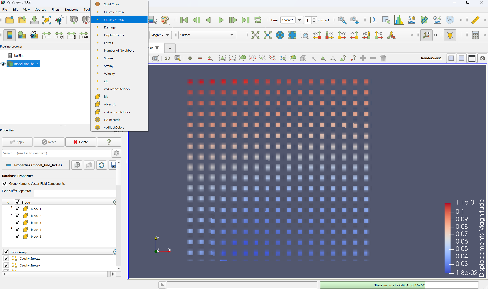
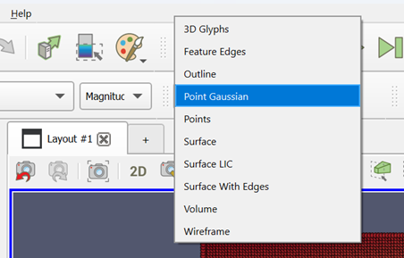
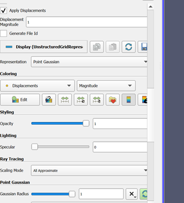

# Getting Started

## Installation

The `PeriLab` package is available through the Julia package system and can be installed as an App using the following commands:

```julia
using Pkg
Pkg.Apps.add("PeriLab")
```

!!! info "Bundled Installation"
    Alternatively, you can also download the binaries for Windows or Linux directly from the [release page](https://github.com/PeriHub/PeriLab.jl/releases), Julia is already included there.

## Using `PeriLab`

The simplest way to run the `PeriLab` simulation core is to use the provided PeriLab Application and go.

```sh
PeriLab -e
PeriLab examples/DCB/DCBmodel.yaml
```
The output should look like this:

```@raw html
<script src="https://asciinema.org/a/649032.js" id="asciicast-649032" async="true"></script>
```

The main functionalities for the `yaml` input deck is given in
```
"examples/functionalities.yaml"
```

## Using `PeriLab` with multiple processors (MPI)

In order to run `PeriLab` for large scale problems [MPI](https://juliaparallel.org/MPI.jl/stable/usage/) needs to be installed:

```sh
$ julia
julia> using MPI
julia> MPI.install_mpiexecjl()
```

Run PeriLab with two processors:
```sh
$ mpiexecjl -n 2 julia -e 'using PeriLab' examples/DCB/DCBmodel.yaml
```

## Postprocessing

For post-processing of the Exodus result files  [ParaView](https://www.paraview.org) is used. You can open the .e file directly. All output data can be find there. At step 0 all zero. They are filled in the first step. The number of steps are defined in the yaml.

The figure shows an example of a plate and the list of possible options.




Because the points are very small, you have the option to use point gaussian as an option. The points get a volume. The standard is a sphere.
The size can be scaled.






## Training

The training input is given under the examples folder. The documentation and a video will follow.

## Index
```@index
Pages = ["getting_started.md"]
```

## Functions
```@meta
CurrentModule = PeriLab
```

```@docs
main
get_examples
```
