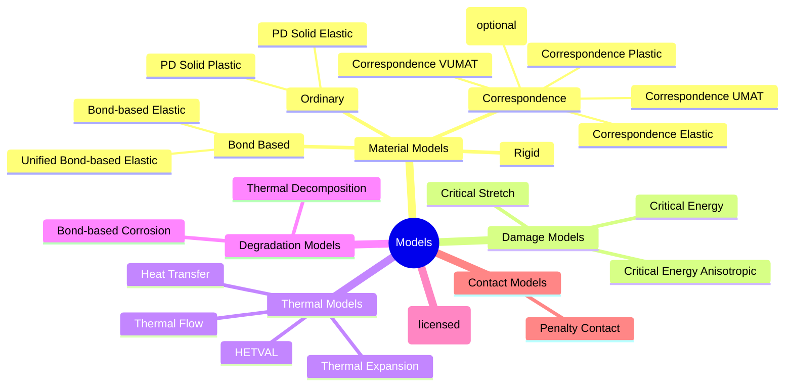

# Models

```mermaid
mindmap
  root((Models))
    Material Models
      Bond Based
        Bond-based Elastic
        Unified Bond-based Elastic
      Ordinary
        PD Solid Elastic
        PD Solid Plastic
      Correspondence
        Correspondence Elastic
        Correspondence Plastic
        Correspondence UMAT
        Correspondence VUMAT
        Bond-associated (optional)
      Rigid
    Damage Models
      Critical Stretch
      Critical Energy
      Critical Energy Anisotropic
    Thermal Models
      Thermal Expansion
      Thermal Flow
      Heat Transfer
      HETVAL
    Degradation Models
      Bond-based Corrosion
      Thermal Decomposition
    Additive Models (licensed)
    Contact Models
      Penalty Contact
```

Every model and its keys are listed in the generated [input models](../../generated/input_models.md) reference.
