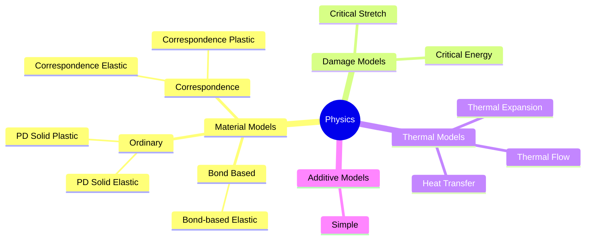

# Physics

```mermaid
mindmap
  root((Physics))
    Material Models
      Bond Based
        Bond-based Elastic
      Ordinary
        PD Solid Elastic
        PD Solid Plastic
      Correspondence
        Correspondence Elastic
        Correspondence Plastic
    Damage Models
      Critical Stretch
      Critical Energy
    Thermal Models
      Thermal Expansion
      Thermal Flow
      Heat Transfer
    Additive Models
        Simple
```