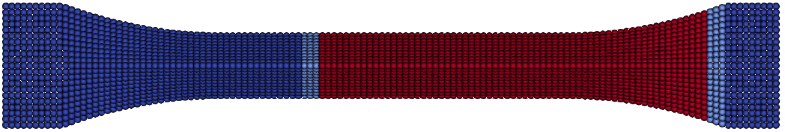
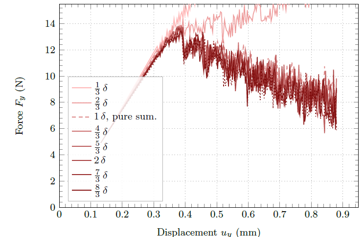

## Condensation
Condensation methods can be used to reduce the number of degress of freedom (dof). The condensated dofs should not be updated and therefore no fracture or non-linear behavior should exist in this region. In theory it is possible, but it leads to continuous update of this region and is inefficient.

## Guyan Condensation
The system is partitioned into slave $s$ and master $m$ dof
[GuyanRJ1965](@cite):

$$\begin{equation}\begin{bmatrix}
\mathbf{K}_{mm} & \mathbf{K}_{ms} \\
\mathbf{K}_{sm} & \mathbf{K}_{ss}
\end{bmatrix}
\begin{bmatrix} \mathbf{u}_m \\ \mathbf{u}_s \end{bmatrix} =
\begin{bmatrix} \mathbf{F}_m \\ \mathbf{0} \end{bmatrix}
\end{equation}$$

Since $\mathbf{F}_s = \mathbf{0}$, the second block row gives:

$$\begin{equation}
\mathbf{K}_{sm}\mathbf{u}_m + \mathbf{K}_{ss}\mathbf{u}_s = \mathbf{0}
\quad\Rightarrow\quad
\mathbf{u}_s = \mathbf{T}\,\mathbf{u}_m, \qquad
\mathbf{T} = -\mathbf{K}_{ss}^{-1}\mathbf{K}_{sm}
\end{equation}$$

Substituting into the first block row yields:

$$\begin{equation}
\mathbf{K}_{mm}\mathbf{u}_m + \mathbf{K}_{ms}\mathbf{T}\mathbf{u}_m
= \mathbf{F}_m
\end{equation}$$

which defines the condensed system
$\hat{\mathbf{K}}_{mm}\,\mathbf{u}_m = \mathbf{F}_m$ with the
condensed stiffness matrix:

$$\begin{equation}
\hat{\mathbf{K}}_{mm} = \mathbf{K}_{mm} - \mathbf{K}_{ms}\mathbf{K}_{ss}^{-1}\mathbf{K}_{sm}
= \mathbf{K}_{mm} - \mathbf{K}_{ms}\mathbf{T}
\end{equation}$$

Following Guyan [GuyanRJ1965](@cite) for dynamic problems, the mass matrix $\mathbf{M}$, which is diagonal  in the PD discretization, is condensed analogously using the
same transformation $\mathbf{T}$:

$$\begin{equation}
\hat{\mathbf{M}}_{mm} = \mathbf{M}_{mm} + \mathbf{T}^T\mathbf{M}_{ss}\mathbf{T}
\end{equation}$$

where $\mathbf{M}_{mm}$ and $\mathbf{M}_{ss}$ are the diagonal mass
submatrices of the master and slave partitions, respectively. The
product $\mathbf{T}^T\mathbf{M}_{ss}\mathbf{T}$ introduces
off-diagonal coupling, so $\hat{\mathbf{M}}_{mm}$ is generally full.
The condensed dynamic system is:

$$\begin{equation}
\hat{\mathbf{M}}_{mm}\ddot{\mathbf{u}}_m +
\hat{\mathbf{K}}_{mm}\,\mathbf{u}_m = \mathbf{F}_m
\end{equation}$$

Several limitations apply. The factorization of $\mathbf{K}_{ss}$
is a one-time preprocessing cost, amortized over all load steps but
potentially significant for very large $\Omega_s$. More importantly,
$\mathbf{T}$ is computed once from the initial stiffness, so
$\Omega_s$ must remain linear elastic and undamaged throughout the
simulation. Finally, inertial effects in $\Omega_s$ are neglected;
high-frequency waves impinging on the $\Omega_s$/$\Omega_m$ interface
are partially reflected rather than correctly transmitted, restricting
the approach to quasi-static or low-frequency dynamic fracture
problems.

### PD--Matrix Coupling within $\Omega_m$
No PD bond may reach into $\Omega_s$, which is enforced by
requiring $\Omega_c$ to be at least one horizon $\delta$ wide around
$\Omega_p$:

$$\mathcal{H}_i \subseteq \Omega_m = \Omega_c \cup \Omega_p
\quad \forall\, i \in \Omega_p$$

If you use model reduction the active part is the point wise method [WillbergC2026](@cite). Fracture can easily be implemented. The equation shows how it works. You have regions $cc$ which includes all matrix parts. In the case of reduced models the active and condensed nodes (.)^c. This region couples in the material point region $pc$ and $cp$. If you want to ''cut'' parts of the matrix you have to delete the $pc$ and $cp$ parts of the material point method $(.)^p$.

```math
\begin{bmatrix} \mathbf{f}_c \\ \mathbf{f}_p \end{bmatrix} =
\underbrace{
\begin{bmatrix}
\hat{\mathbf{K}}_{cc} & \hat{\mathbf{K}}^{c}_{cp}+\hat{\mathbf{K}}^{p}_{cp} \\
\hat{\mathbf{K}}^{c}_{pc}+\hat{\mathbf{K}}^{p}_{pc} & \hat{\mathbf{K}}_{pp}
\end{bmatrix}
\begin{bmatrix} \mathbf{u}_c \\ \mathbf{u}_p \end{bmatrix}
}_{\text{Matrix part}}
+
\underbrace{
\begin{bmatrix}
\mathbf{f}_c^{\mathrm{pd}} \\
\mathbf{f}_p^{\mathrm{pd}}
\end{bmatrix}
}_{\text{Material point part}}
```
where $\hat{\mathbf{K}}^{p}_{cp}=\hat{\mathbf{K}}^{p}_{pc}=\hat{\mathbf{K}}_{pp}=\mathbf{0}$ by construction.
The distance to the reduced nodes is large enough. The figure shows that $2\delta$ should be at least the distance from the fracture.




- **Slave nodes** (red, $\Omega_s$): Far-field region,
    condensed out. Must remain linear elastic, undamaged, and carry
    no external loads.
- **Matrix nodes** (light blue, $\Omega_c \subset \Omega_m$):
    Solved via the stiffness matrix. Captures load introduction,
    boundary conditions, and correct stiffness distributions. Must
    remain undamaged.
- **PD nodes** (blue, $\Omega_p \subset \Omega_m$):
    Damage region. Bond forces are evaluated via the material point
    formulation at each time step.



