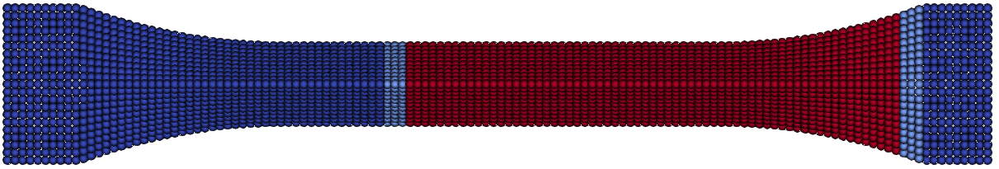
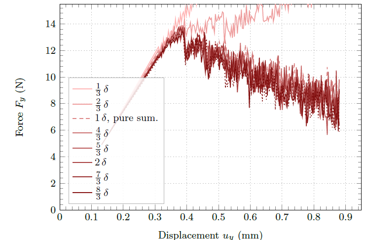

## Condensation
Condensation methods can be used to reduce the number of degress of freedom (dof). The condensated dofs should not be updated and therefore no fracture or non-linear behavior should exist in this region. In theory it is possible, but it leads to continuous update of this region and is inefficient.

## Guyan Condensation
The system is partitioned into condensed $l$ and retained $r$ dof
[GuyanRJ1965](@cite):

$$\begin{equation}\begin{bmatrix}
\mathbf{K}_{rr} & \mathbf{K}_{rl} \\
\mathbf{K}_{lr} & \mathbf{K}_{ll}
\end{bmatrix}
\begin{bmatrix} \mathbf{u}_r \\ \mathbf{u}_l \end{bmatrix} =
\begin{bmatrix} \mathbf{F}_r \\ \mathbf{0} \end{bmatrix}
\end{equation}$$

Since $\mathbf{F}_l = \mathbf{0}$, the second block row gives:

$$\begin{equation}
\mathbf{K}_{lr}\mathbf{u}_r + \mathbf{K}_{ll}\mathbf{u}_l = \mathbf{0}
\quad\Rightarrow\quad
\mathbf{u}_l = \mathbf{T}\,\mathbf{u}_r, \qquad
\mathbf{T} = -\mathbf{K}_{ll}^{-1}\mathbf{K}_{lr}
\end{equation}$$

Substituting into the first block row yields:

$$\begin{equation}
\mathbf{K}_{rr}\mathbf{u}_r + \mathbf{K}_{rl}\mathbf{T}\mathbf{u}_r
= \mathbf{F}_r
\end{equation}$$

which defines the condensed system
$\hat{\mathbf{K}}_{rr}\,\mathbf{u}_r = \mathbf{F}_r$ with the
condensed stiffness matrix:

$$\begin{equation}
\hat{\mathbf{K}}_{rr} = \mathbf{K}_{rr} - \mathbf{K}_{rl}\mathbf{K}_{ll}^{-1}\mathbf{K}_{lr}
= \mathbf{K}_{rr} - \mathbf{K}_{rl}\mathbf{T}
\end{equation}$$

Following Guyan [GuyanRJ1965](@cite) for dynamic problems, the mass matrix $\mathbf{M}$, which is diagonal  in the PD discretization, is condensed analogously using the
same transformation $\mathbf{T}$:

$$\begin{equation}
\hat{\mathbf{M}}_{rr} = \mathbf{M}_{rr} + \mathbf{T}^T\mathbf{M}_{ll}\mathbf{T}
\end{equation}$$

where $\mathbf{M}_{rr}$ and $\mathbf{M}_{ll}$ are the diagonal mass
submatrices of the retained and condensed partitions, respectively. The
product $\mathbf{T}^T\mathbf{M}_{ll}\mathbf{T}$ introduces
off-diagonal coupling, so $\hat{\mathbf{M}}_{rr}$ is generally full.
The condensed dynamic system is:

$$\begin{equation}
\hat{\mathbf{M}}_{rr}\ddot{\mathbf{u}}_r +
\hat{\mathbf{K}}_{rr}\,\mathbf{u}_r = \mathbf{F}_r
\end{equation}$$

Several limitations apply. The factorization of $\mathbf{K}_{ll}$
is a one-time preprocessing cost, amortized over all load steps but
potentially significant for very large $\Omega_l$. More importantly,
$\mathbf{T}$ is computed once from the initial stiffness, so
$\Omega_l$ must remain linear elastic and undamaged throughout the
simulation. Finally, inertial effects in $\Omega_l$ are neglected;
high-frequency waves impinging on the $\Omega_l$/$\Omega_r$ interface
are partially reflected rather than correctly transmitted, restricting
the approach to quasi-static or low-frequency dynamic fracture
problems.

### PD--Matrix Coupling within $\Omega_r$
No PD bond may reach into $\Omega_l$, which is enforced by
requiring $\Omega_c$ to be at least one horizon $\delta$ wide around
$\Omega_p$:

$$\mathcal{H}_i \subseteq \Omega_r = \Omega_c \cup \Omega_p
\quad \forall\, i \in \Omega_p$$

If you use model reduction the active part is the point wise method [WillbergC2026](@cite). Fracture can easily be implemented. The equation shows how it works. You have regions $cc$ which includes all matrix parts. In the case of reduced models the active and condensed nodes (.)^c. This region couples in the material point region $pc$ and $cp$. If you want to ''cut'' parts of the matrix you have to delete the $pc$ and $cp$ parts of the material point method $(.)^p$.

```math
\begin{bmatrix} \mathbf{f}_c \\ \mathbf{f}_p \end{bmatrix} =
\underbrace{
\begin{bmatrix}
\hat{\mathbf{K}}_{cc} & \hat{\mathbf{K}}^{c}_{cp}+\hat{\mathbf{K}}^{p}_{cp} \\
\hat{\mathbf{K}}^{c}_{pc}+\hat{\mathbf{K}}^{p}_{pc} & \hat{\mathbf{K}}_{pp}
\end{bmatrix}
\begin{bmatrix} \mathbf{u}_c \\ \mathbf{u}_p \end{bmatrix}
}_{\text{Matrix part}}
+
\underbrace{
\begin{bmatrix}
\mathbf{f}_c^{\mathrm{pd}} \\
\mathbf{f}_p^{\mathrm{pd}}
\end{bmatrix}
}_{\text{Material point part}}
```
where $\hat{\mathbf{K}}^{p}_{cp}=\hat{\mathbf{K}}^{p}_{pc}=\hat{\mathbf{K}}_{pp}=\mathbf{0}$ by construction.
The distance to the reduced nodes is large enough. The figure shows that $2\delta$ should be at least the distance from the fracture.




- **Condensed nodes** (red, $\Omega_l$): Far-field region,
    condensed out. Must remain linear elastic, undamaged, and carry
    no external loads.
- **Matrix nodes** (light blue, $\Omega_c \subset \Omega_r$):
    Solved via the stiffness matrix. Captures load introduction,
    boundary conditions, and correct stiffness distributions. Must
    remain undamaged.
- **PD nodes** (blue, $\Omega_p \subset \Omega_r$):
    Damage region. Bond forces are evaluated via the material point
    formulation at each time step.




## Craig Bampton condensation

Guyan condensation carries the mass of the condensed region through
$\mathbf{T}^T\mathbf{M}_{ll}\mathbf{T}$, but admits no deformation of $\Omega_l$ other
than the static one prescribed by $\mathbf{T}$. The condensed region contributes inertia
without deformation modes of its own, which introduces errors at higher frequencies.
Craig-Bampton condensation [CraigRR1968](@cite) retains the static relation and adds those modes.

The partitioning into condensed $l$ and retained $r$ dof is the one used above. The
displacement field is expressed through two sets of shape functions:

$$\begin{equation}
\begin{bmatrix} \mathbf{u}_r \\ \mathbf{u}_l \end{bmatrix} =
\underbrace{\begin{bmatrix}
\mathbf{I} & \mathbf{0} \\
\boldsymbol{\Phi}_c & \boldsymbol{\Phi}_n
\end{bmatrix}}_{\mathbf{T}}
\begin{bmatrix} \mathbf{u}_r \\ \boldsymbol{\eta} \end{bmatrix}
\end{equation}$$

The constraint modes $\boldsymbol{\Phi}_c = -\mathbf{K}_{ll}^{-1}\mathbf{K}_{lr}$ are
the static response of $\Omega_l$ to a unit displacement of each retained dof and are
identical to the Guyan transformation. The fixed-interface normal modes
$\boldsymbol{\Phi}_n$ follow from the eigenvalue problem of the condensed region with all
retained dof held fixed:

$$\begin{equation}
\mathbf{K}_{ll}\boldsymbol{\Phi}_n = \mathbf{M}_{ll}\boldsymbol{\Phi}_n\boldsymbol{\Lambda},
\qquad \boldsymbol{\Lambda} = \mathrm{diag}(\omega_1^2,\dots,\omega_{n}^2)
\end{equation}$$

Only the $n$ lowest modes are retained; the modal amplitudes $\boldsymbol{\eta}$ are not
displacements. Mass normalisation of the modes,

$$\begin{equation}
\boldsymbol{\Phi}_n^T\mathbf{M}_{ll}\boldsymbol{\Phi}_n = \mathbf{I},
\qquad
\boldsymbol{\Phi}_n^T\mathbf{K}_{ll}\boldsymbol{\Phi}_n = \boldsymbol{\Lambda}
\end{equation}$$

determines the structure of the reduced matrices
$\hat{\mathbf{K}} = \mathbf{T}^T\mathbf{K}\mathbf{T}$ and
$\hat{\mathbf{M}} = \mathbf{T}^T\mathbf{M}\mathbf{T}$:

$$\begin{equation}
\hat{\mathbf{K}} =
\begin{bmatrix}
\hat{\mathbf{K}}_{rr} & \mathbf{0} \\
\mathbf{0} & \boldsymbol{\Lambda}
\end{bmatrix},
\qquad
\hat{\mathbf{M}} =
\begin{bmatrix}
\hat{\mathbf{M}}_{rr} & \boldsymbol{\Phi}_c^T\mathbf{M}_{ll}\boldsymbol{\Phi}_n \\
\boldsymbol{\Phi}_n^T\mathbf{M}_{ll}\boldsymbol{\Phi}_c & \mathbf{I}
\end{bmatrix}
\end{equation}$$

The blocks $\hat{\mathbf{K}}_{rr}$ and $\hat{\mathbf{M}}_{rr}$ are those of the Guyan
reduction; setting $n = 0$ removes the modal block and recovers it exactly. The
off-diagonal blocks of $\hat{\mathbf{K}}$ vanish because
$\mathbf{K}_{ll}\boldsymbol{\Phi}_c = -\mathbf{K}_{lr}$ makes the contributions
$\mathbf{K}_{rl}\boldsymbol{\Phi}_n$ and
$\boldsymbol{\Phi}_c^T\mathbf{K}_{ll}\boldsymbol{\Phi}_n$ cancel: constraint modes and
fixed-interface modes are $\mathbf{K}$-orthogonal. The mass exhibits no such
cancellation, so both parts remain coupled through inertia. The condensed system reads:

$$\begin{equation}
\hat{\mathbf{M}}
\begin{bmatrix} \ddot{\mathbf{u}}_r \\ \ddot{\boldsymbol{\eta}} \end{bmatrix}
+
\hat{\mathbf{K}}
\begin{bmatrix} \mathbf{u}_r \\ \boldsymbol{\eta} \end{bmatrix}
=
\begin{bmatrix} \mathbf{F}_r \\ \mathbf{0} \end{bmatrix}
\end{equation}$$

It has $n_r + n$ dof. Boundary conditions and external loads act on the $n_r$ physical
retained dof; the $n$ modal amplitudes are integrated alongside them. Loads on condensed
dof would require the projection
$\mathbf{F}_\eta = \boldsymbol{\Phi}_n^T\mathbf{F}_l$ and are not supported.

$\Omega_l$ must remain linear elastic and undamaged, since $\boldsymbol{\Phi}_c$ and
$\boldsymbol{\Phi}_n$ are computed once from the initial stiffness. The eigenvalue
problem adds to the preprocessing cost of the factorization of $\mathbf{K}_{ll}$. In
return, waves crossing the $\Omega_l$/$\Omega_r$ interface are transmitted correctly up
to approximately $\omega_n$; above that frequency they are reflected.

## Multi-Level Craig-Bampton (Cascade)

For a condensed region too large to factorize and solve the eigenvalue problem for in one
piece -- both scale with the total number of condensed dof -- the reduction can instead be
done in several levels. The condensed region grows from the side farthest from $\Omega_r$
inward, one shell $S_k$ at a time; each level condenses only that shell together with the
superelement carried in from the level before it, never the whole remaining region.

Level 1 reduces $\Omega_1$ exactly as above, giving a superelement with dof
$\mathbf{x}^{(1)} = [\mathbf{u}_{\Gamma_1}^T,\,\mathbf{q}_1^T]^T$: the interface
$\Gamma_1$ (the material points of $\Omega_1$ with a bond outside it) plus $\mathbf{q}_1$,
its own fixed-interface modes. On level $k \ge 2$ the region is extended by the next shell,
$\Omega_k = \Omega_{k-1} \cup S_k$. Because $\Gamma_{k-1}$ was constructed to be exactly
the boundary of $\Omega_{k-1}$, $S_k$ only couples to the previous superelement through
that interface, so the two combine into one local system without anything else from
$\Omega_{k-1}$ re-entering it. Of that local system, only the new interface
$\Gamma_k \subset S_k$ stays retained; the rest of $S_k$, the previous interface
$\Gamma_{k-1}$, and the previous modes $\mathbf{q}_{k-1}$ are all condensed together --
replaced by a fresh $\Gamma_k$ and a fresh $\mathbf{q}_k$, not accumulated with the
earlier ones. After the last level $K$, $\Gamma_K$ borders $\Omega_r$ itself and the
resulting $\hat{\mathbf{K}}$, $\hat{\mathbf{M}}$ enter the time integration exactly like
the single-level ones above.

The size of the system solved on level $k$ is therefore bounded by the width of $S_k$ and
the size of $\Gamma_{k-1}$/$\mathbf{q}_{k-1}$ -- never by how much of $\Omega_l$ has
already been absorbed -- so the cost grows with the number of levels, not with the size of
the whole condensed region. Two consequences follow directly. Replacing rather than
accumulating the physical interface is exact, for the same reason the single-level
reduction is exact: two condensed dof at different levels can only be directly coupled if
their levels are adjacent, so nothing outside a shell and the interface it replaces is
ever reachable from what that level eliminates. Replacing the modal coordinates is not:
each level's $\mathbf{q}_k$ is a fresh fixed-interface eigenproblem of only that level's
local system, not of $\Omega_l$ as a whole, so truncation error accumulates across levels.
Using the same mode count/cutoff frequency throughout, well above the frequency band that
actually matters, keeps this controlled; `Number of Modes` `= 0` remains the exact, static
(Guyan) limit at every level, unaffected by any of this.

In practice the levels are found and sized automatically -- there is no user-facing
"level count" to set. `Max Memory MiB` and `Dense Shell Limit` are the two knobs that
matter for a condensed region large enough to need this scheme at all; see the option
table under [Verlet Matrix Based](@ref) for both.
