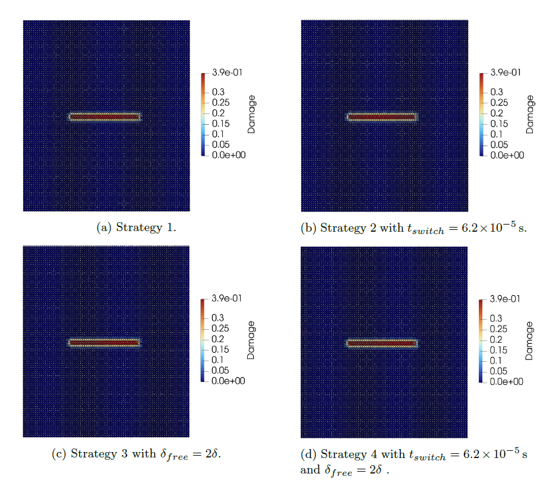
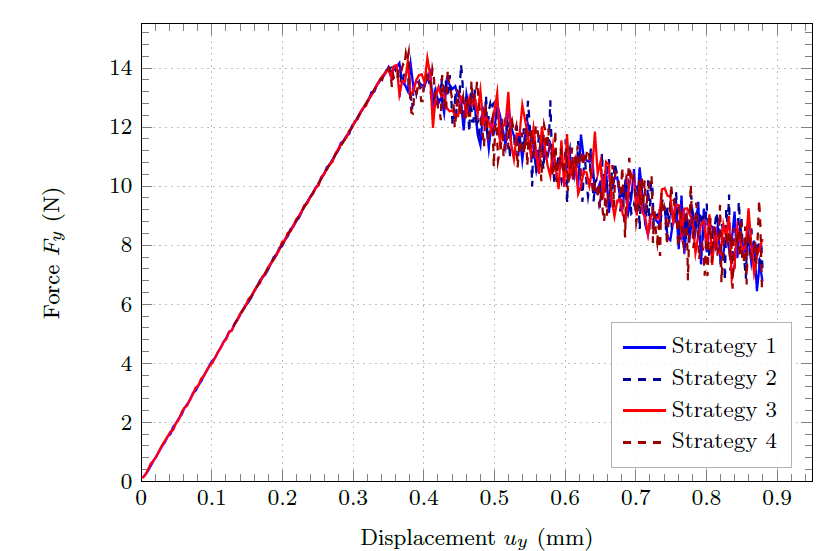

# Verification

## Matrix based solver Strategies
The following strategies are provided in [WillbergC2026](@cite).
### Strategy 1: Verlet — Pointwise Summation
Full-domain Velocity-Verlet integration with pointwise bond-force summation throughout. Reference solution.

**Strategy 2: Static + Pointwise Verlet**

Linear static solver assembles **K once** and solves `Ku = F_ext` incrementally during load introduction. At each increment, bond damage indicators are checked; the load factor λ* at first failure is determined by linearity and scaled by S < 1. The static solution initialises the Verlet phase (`u₀ = λ* u_static`). Dynamic phase uses pointwise summation — no matrix update needed on bond breakage.

**Strategy 3: Guyan-Condensed Verlet**

Guyan condensation applied from the start. Domain partitioned into slave nodes (condensed), matrix master nodes Ω_c, and PD nodes Ω_p. Condensed dynamic system integrated with Velocity-Verlet throughout.

**Strategy 4: Static + Guyan-Condensed Verlet**

Combines Strategy 2 (static load introduction) with Strategy 3 (condensed dynamic phase). After the static phase, slave DOFs are eliminated and the condensed system is integrated with Velocity-Verlet. Efficient load introduction + reduced active DOFs during crack propagation.

### Solutions

The crack path is given here and practically identical.


The force displacement curve is given here. It shows that all variants are in good agreement.

```@raw html

```
